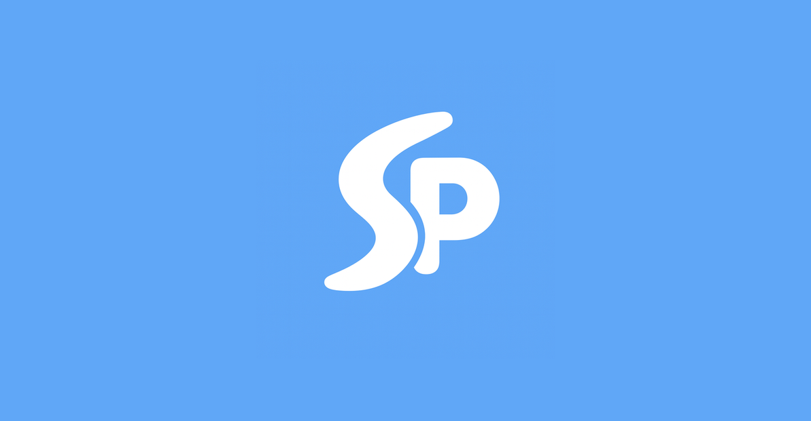
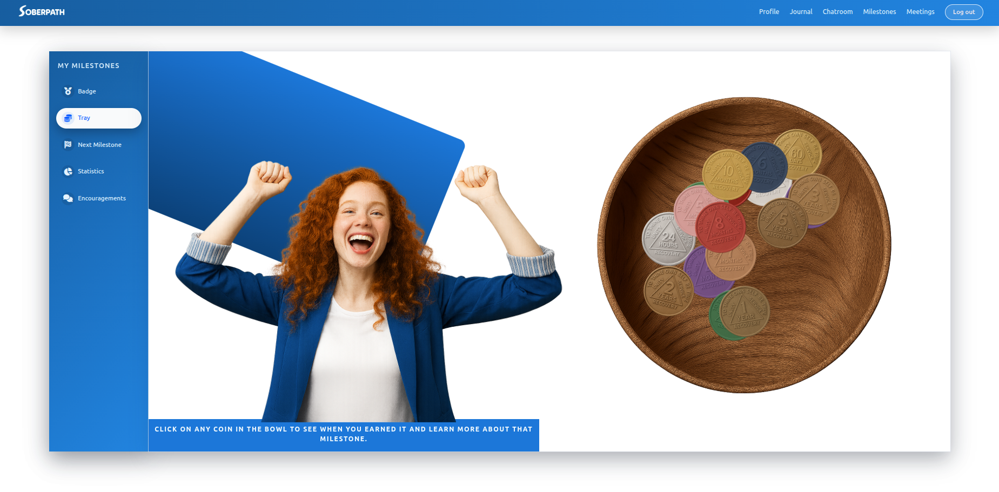
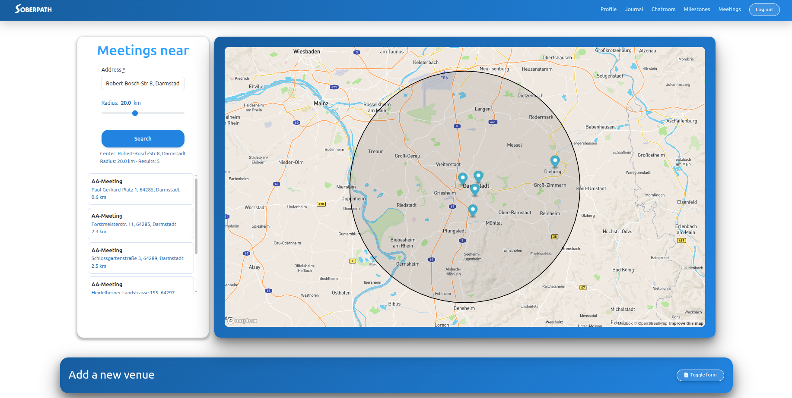

Rails app generated with [lewagon/rails-templates](https://github.com/lewagon/rails-templates), created by the [Le Wagon coding bootcamp](https://www.lewagon.com) team.
# 🍃 SoberPath — Your Digital Companion for an Alcohol-Free Life

<p align="center">
  <!-- Animated typing headline (feel free to remove if you prefer static) -->
  
</p>

<p align="center">
  
</p>

<p align="center">
  <b>SoberPath</b> is a structured, private space to reflect, track progress, and connect — built to support an alcohol-free life with community + gentle AI tools.
</p>

<p align="center">
  
  
  
  
  
</p>

---

## ✨ Quick Peek

<p align="center">
  
</p>

> **SoberPath** helps you carry less alone: journal your days, connect with others, celebrate progress — and find support when you need it.

---

## 🌱 What is SoberPath?

SoberPath is your structured, digital companion on the journey to an alcohol-free life.  
Instead of carrying everything alone, you have a private space to reflect on your thoughts, feelings, and daily experiences — and to see more clearly what supports you, what triggers you, and what truly matters.

---

## 🤍 Why it exists

Many people struggling with alcohol face daily challenges like:

- 😔 Isolation and shame  
- 🔄 Higher relapse risk without support  
- ⏰ No flexible 24/7 support when cravings hit  
- 📉 Little sense of visible progress  
- 📊 Only a minority receives professional help  

SoberPath aims to ease some of this weight by giving you a discreet, digital community that can be with you wherever you are in the world — a place to feel seen, encouraged, and reminded: **you are not doing this alone**.

---

## 🧭 What you can do in SoberPath

### 📝 Daily journal with AI visuals
Capture your thoughts, cravings, wins, and difficult moments in a daily journal. Based on what you write, an **AI-generated image** can reflect the mood of your entry and make your journey visible over time.

<p align="center">
  
</p>

**GIF idea (optional):**  
Create a 6–10s clip: write entry → submit → AI image appears → timeline shows it.  
Suggested filename: `assets/gif-journal-ai.gif`

---

### 💬 Chatroom & community support (WebSockets + Turbo Streams)
Talk to an AI when you want to sort your thoughts anonymously, and join a general group chat to connect with other users.  
Every message can feel like a mini meeting: you share, you listen, you encourage.

<p align="center">
  
</p>

**GIF idea (optional):**  
Record a “Turbo moment”: message appears instantly in the room.  
Suggested filename: `assets/gif-chat-live.gif`

---

### 🏁 Personal milestone page
See your sober milestones in one place and read the congratulations and encouragement from other users. Progress becomes not only measurable, but emotionally real.

<p align="center">
  
</p>

**GIF idea (optional):**  
Milestone unlock animation / confetti / “Congrats” messages arriving.  
Suggested filename: `assets/gif-milestones.gif`

---

### 🗺️ Find AA meetings nearby
When you feel the need for in-person support, you can look up registered AA meetings in your area and seek additional real-life connection.

<p align="center">
  
</p>

**GIF idea (optional):**  
Zoom map → type city → pins appear → open meeting details.  
Suggested filename: `assets/gif-aa-map.gif`

---

## 🔞 Audience & Disclaimer (Important)

SoberPath is designed for **adults aged 18+** who want extra support with discretion, digital tools, and the power of community and motivation.

> **Not medical advice:** SoberPath is not a replacement for real-life AA meetings or for psychologists and professional addiction counselors.  
> It is a complement: a safe, encouraging space that supports you in everyday life and helps you stay focused on your goal — a sober, self-determined life.

If you are in immediate danger or feel unsafe, contact local emergency services or a crisis hotline in your region.

---

## 🧱 Tech Stack

- **Ruby on Rails**
- **SCSS**
- **Stimulus**
- **Turbo Streams (Hotwire)**
- **PostgreSQL**
- **WebSockets** (Rails Action Cable)

Integrations:
- **Cloudinary** (media/uploads)
- **Mapbox** (maps + meeting discovery)
- **OpenAI** (AI chat + journal mood visuals)

---

## ⚙️ Setup (Local Development)

### 1) Clone
```bash
git clone https://github.com/<your-username>/soberpath.git
cd soberpath
```

### 2) Environment variables
```.env
CLOUDINARY_URL=...
MAPBOX_API_KEY=...
OPENAI_ACCESS_TOKEN=...
```
✅ Required for uploads (Cloudinary), maps (Mapbox), and AI features (OpenAI).
❗ Don’t commit .env.

### 3) Install dependencies
```bash
bundle install
```

### 4) Database
```bash
bin/rails db:create db:migrate
# optional:
bin/rails db:seed
```

### 5) Run
```bash
bin/rails server
```
### ✅ Open the app
After starting the server, open the app in your browser:
👉 http://localhost:3000


### ✅ Open the app
After starting the server, open the app in your browser:

👉 http://localhost:3000

---

## 🔌 Real-time features (Chat / Community)
SoberPath uses Action Cable + Turbo Streams for a live community experience.

If live updates don’t show locally, check:

- `config/cable.yml`
- adapter requirements (async/redis depending on your setup)
- browser console + Rails logs for Action Cable connection messages


### ✅ Open the app
After starting the server, open the app in your browser:

👉 http://localhost:3000

---

## 🔌 Real-time features (Chat / Community)
SoberPath uses Action Cable + Turbo Streams for a live community experience.

If live updates don’t show locally, check:

- `config/cable.yml`
- adapter requirements (async/redis depending on your setup)
- browser console + Rails logs for Action Cable connection messages

---

## 🖼️ Screenshot Gallery (All in one place)
<p align="center">
  
  
</p>
<p align="center">
  
  
</p>
<p align="center">
  
</p>

---

## 🗺️ Roadmap (Ideas)
- 🔔 “SOS Mode” for cravings (grounding prompts + quick support)
- 🧑‍🤝‍🧑 Buddy system / smaller circles
- 📈 Trigger patterns & progress summaries
- 🌍 Localization (DE/EN + more)
- 🛡️ Enhanced moderation & reporting tools

---

## 🤝 Contributing
PRs are welcome — especially around:

- accessibility + mobile UX
- UI polish & animations
- community safety / moderation
- onboarding flows
- tests and docs

```bash
git checkout -b feature/my-change

